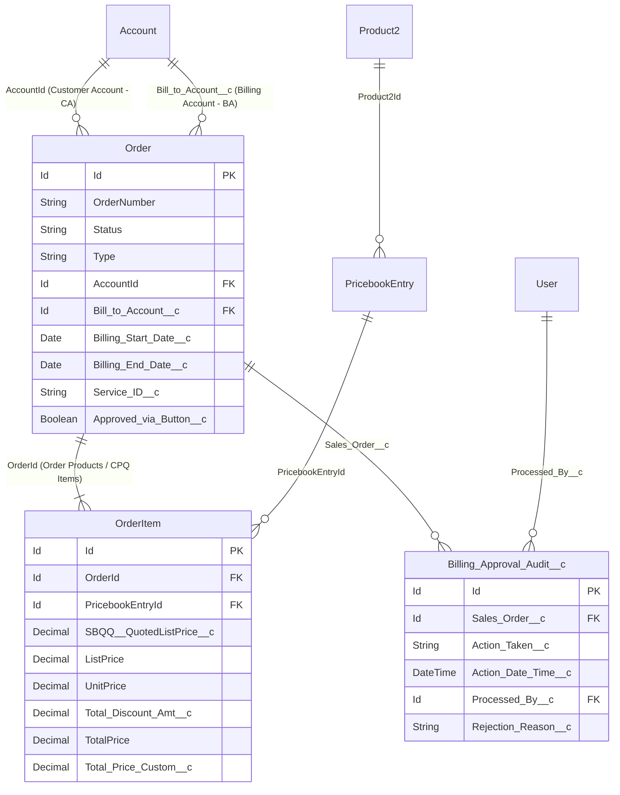

# Panduan Arsitektur & Dokumentasi Teknis Mass Billing Approval ⚡

Dokumentasi ini dibuat sebagai referensi teknis komprehensif bagi developer untuk memahami arsitektur sistem, data model, relasi antar object, struktur kode, serta panduan langkah demi langkah (*step-by-step*) untuk melakukan modifikasi atau pengembangan mandiri (*manual development*) di masa mendatang.

---

## 1. 🏗️ Arsitektur Data Model & Relasi Antar Object (ERD)

Modul **Mass Billing Approval** beroperasi di atas 6 object utama Salesforce:



### Rincian Peran Setiap Object:

| Object Name | Tipe Relasi | Peran Fungsional dalam Modul |
| :--- | :--- | :--- |
| **`Order`** | Core Entity | Objek sentral yang divalidasi dan di-approve/reject. Status berubah dari `'Billing Approval'` $\rightarrow$ `'Completed'` (saat approve) atau `'BASO In Progress'` (saat reject). |
| **`Account`** | Lookup ke Order (`AccountId` & `Bill_to_Account__c`) | `AccountId` mewakili *Customer Account (CA)*. `Bill_to_Account__c` mewakili *Billing Account (BA)* tempat invoice diterbitkan. Dropdown filter di UI memfilter berdasarkan CA. |
| **`OrderItem`** | Master-Detail ke Order (`OrderId`) | Berisi detail item produk CPQ, harga, dan diskon. Modul melakukan agregasi otomatis (*sum list price, discount, net total*) di memory untuk CPQ bundle. |
| **`Product2`** & **`PricebookEntry`** | Lookup ke OrderItem | Menyediakan nama produk utama (`Product2.Name`) yang ditampilkan pada kolom Product Name di tabel approval. |
| **`Billing_Approval_Audit__c`** | Lookup ke Order (`Sales_Order__c`) | Objek custom untuk mencatat riwayat audit permanen: siapa yang mengeksekusi (`Processed_By__c`), aksi (`Action_Taken__c`), tanggal (`Action_Date_Time__c`), dan alasan reject (`Rejection_Reason__c`). |
| **`User`** | Lookup dari `Processed_By__c` | Mencatat User ID staf billing yang menekan tombol Approve/Reject. |

---

## 2. 🧩 Struktur Layer & Komponen Teknis

```
force-app/main/default/
├── classes/
│   ├── MassBillingApprovalService.cls        # Service Layer: Query, In-Memory DTO, DML Bulk Engine
│   ├── MassBillingApprovalController.cls     # Controller Layer: @AuraEnabled endpoints
│   └── MassBillingApprovalTest.cls           # Unit Test Layer: 100% Code Coverage
├── lwc/
│   └── massBillingApproval/
│       ├── massBillingApproval.html          # UI Template: Tabs, Datatable, Error Modal
│       ├── massBillingApproval.js            # Controller UI: Dual-Store, Auto-Padding, Bulk Actions
│       ├── massBillingApproval.css           # Styling
│       └── massBillingApproval.js-meta.xml   # Target Config (App Page, Home Page, Record Page)
├── objects/
│   ├── Billing_Approval_Audit__c/            # Custom Object & 5 Custom Fields
│   └── Order/fields/
│       └── Approved_via_Button__c.field-meta.xml
├── layouts/
│   └── Billing_Approval_Audit__c-Billing Approval Audit Layout.layout-meta.xml
├── staticresources/
│   ├── MassBillingTemplate.csv               # Downloadable CSV Template
│   └── MassBillingTemplate.resource-meta.xml
└── tabs/
    └── Mass_Billing_Approval.tab-meta.xml    # Lightning Navigation Tab
```

---

## 3. ⚙️ Penjelasan Logika Bisnis Utama

### A. Pola In-Memory DTO (Data Transfer Object)
Modul ini **tidak memerlukan objek staging fisik di database**, melainkan mengubah hasil query Order menjadi struktur DTO ringan di memory server Apex:
```apex
public class OrderReviewDTO {
    @AuraEnabled public String id { get; set; }
    @AuraEnabled public String orderId { get; set; }
    @AuraEnabled public String orderNumber { get; set; }
    @AuraEnabled public String orderType { get; set; }
    @AuraEnabled public String statusOrder { get; set; }
    @AuraEnabled public String customerAccountName { get; set; }
    @AuraEnabled public String billingAccountName { get; set; }
    @AuraEnabled public Date billingDate { get; set; }
    @AuraEnabled public String productName { get; set; }
    @AuraEnabled public Decimal quoteListPrice { get; set; }
    @AuraEnabled public Decimal discount { get; set; }
    @AuraEnabled public Decimal total { get; set; }
    @AuraEnabled public String serviceId { get; set; }
    @AuraEnabled public String validationStatus { get; set; }
    @AuraEnabled public String validationMessage { get; set; }
}
```

### B. Aturan Penentuan Billing Date
Di dalam method `mapOrderToDTO`:
- **SO DO (`Deactive` / `Disconnect`) & SO Suspend (`Suspend`)**: Mengambil **`Billing_End_Date__c`** (karena penagihan dihentikan per tanggal tersebut).
- **Selain itu (`New` / AO, `Modify` / MO, `Resume` / RO)**: Mengambil **`Billing_Start_Date__c`**.

### C. Normalisasi Leading Zeros (Excel Stripping Fix)
Untuk menangani Excel yang memotong angka nol di depan (misal `00068134` menjadi `68134`):
1. **Di LWC (`massBillingApproval.js`)**: `val.padStart(8, '0')`
2. **Di Apex (`MassBillingApprovalService.cls`)**: `k.leftPad(8, '0')` dan mencocokkan format asli maupun format 8 digit di SOQL query.

### D. Partial Success Execution & Error Summary Modal
Eksekusi DML menggunakan `Database.update(ordersToUpdate, false)` (*AllOrNone = false*):
- Order yang lolos validasi $\rightarrow$ **Langsung di-update ke `Completed`** dan dibuatkan record audit `Approved`.
- Order yang gagal validasi $\rightarrow$ Error-nya ditangkap ke dalam list `FailedOrderDTO` $\rightarrow$ memicu pop-up **Error Summary Modal** di UI dengan tombol **Export Failed Orders (CSV)**.

---

## 4. 🛠️ Panduan Pengembangan Mandiri (How-To Guide)

### Skenario 1: Menambahkan Kolom Baru di Tabel
Misal ingin menambahkan kolom **Contract Number**:

1. **Buka `MassBillingApprovalService.cls`**:
   - Tambahkan property di `OrderReviewDTO`:
     ```apex
     @AuraEnabled public String contractNumber { get; set; }
     ```
   - Tambahkan field `Contract.ContractNumber` pada query SOQL di method `getLiveOrders` dan `getOrdersByUploadedKeys`.
   - Di method `mapOrderToDTO`, assign nilainya:
     ```apex
     dto.contractNumber = ord.Contract != null ? ord.Contract.ContractNumber : '-';
     ```

2. **Buka `massBillingApproval.js`**:
   - Tambahkan definisi kolom pada `LIVE_COLUMNS`:
     ```javascript
     { label: 'Contract Number', fieldName: 'contractNumber', type: 'text', initialWidth: 150 },
     ```

3. **Deploy perubahan ke Sandbox**:
   ```bash
   sf project deploy start --source-dir force-app/main/default/classes force-app/main/default/lwc --target-org <ORG_ALIAS>
   ```

---

### Skenario 2: Mengubah Status Tujuan Rejection
Misal ingin mengubah status saat di-reject menjadi `Draft` (bukan `BASO In Progress`):

1. **Buka `MassBillingApprovalService.cls`**:
   - Di method `processMassRejection`, ubah:
     ```apex
     ord.Status = 'Draft';
     ```
2. **Buka `massBillingApproval.js`**:
   - Di method `handleConfirmReject`, sesuaikan status update lokal:
     ```javascript
     return { ...r, statusOrder: 'Draft', validationStatus: 'Rejected' };
     ```
3. **Update Test Class `MassBillingApprovalTest.cls`** dan jalankan:
   ```bash
   sf apex run test --tests MassBillingApprovalTest --target-org <ORG_ALIAS>
   ```

---

### Skenario 3: Deployment Bersih Menggunakan Manifest Package XML
Untuk mendeploy seluruh modul secara utuh ke org mana pun (SIT, Staging, Production):

```bash
sf project deploy start --manifest manifest/package-mass-billing.xml --target-org <TARGET_ORG> --test-level RunSpecifiedTests --tests MassBillingApprovalTest
```

---

## 📄 License & Maintenance
Modul ini dikembangkan untuk PT Telkom Infrastruktur Indonesia (TIF). Seluruh hak cipta dan kode sumber dikelola di bawah arsitektur repository Git internal.